# 🚀 APIFlow AI — Multi API Integration Platform

A full-stack MERN application that lets a user log in once and drive multiple third-party APIs — weather, news, currency conversion, GitHub lookups, and Google Gemini AI — from a single dashboard, individually or chained together into automated **workflows**. Every execution is authenticated, logged, and viewable from an analytics dashboard.

🌐 **Live Demo:** https://multi-api-integration-platform-x4tc.vercel.app/
🔗 **Backend API:** https://multi-api-backend.onrender.com/
👨‍💻 **Author:** [Satwik Maiti](https://github.com/Satwik367)

---

## 📸 Screenshots

|                                                                   |                                                                       |
| ----------------------------------------------------------------- | --------------------------------------------------------------------- |
| **Landing Page** 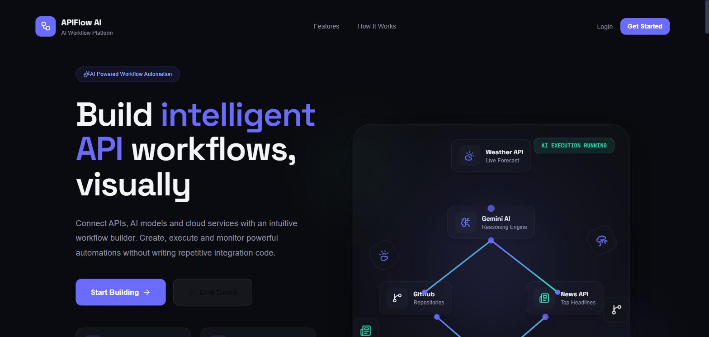    | **Login / Register** 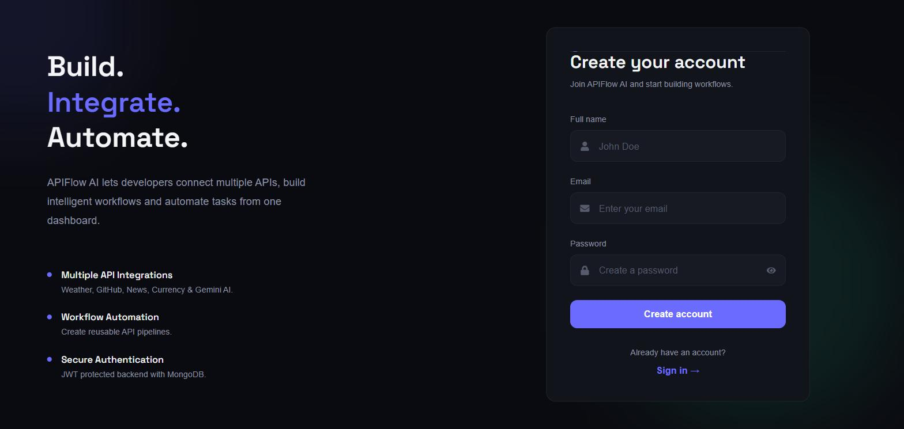                    |
| **Dashboard** 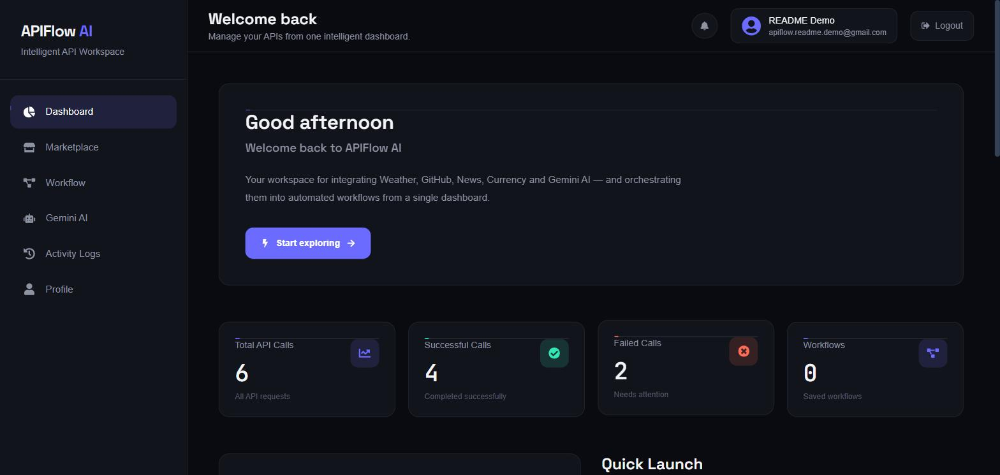             | **API Marketplace** 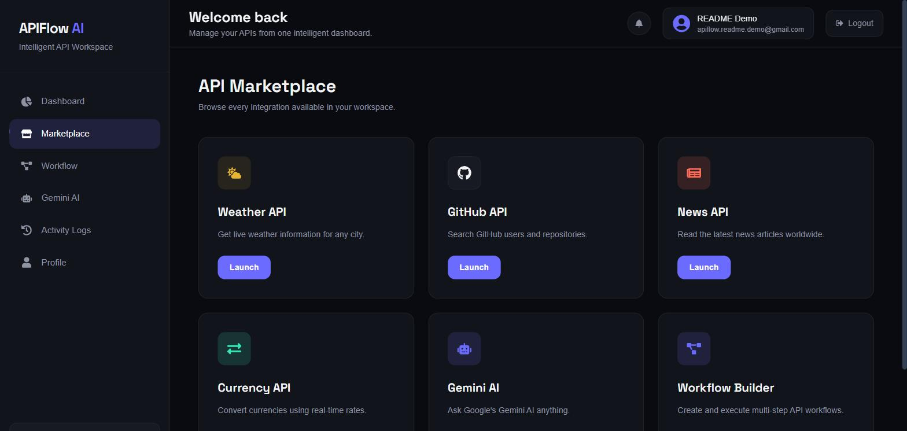       |
| **Weather Executor** 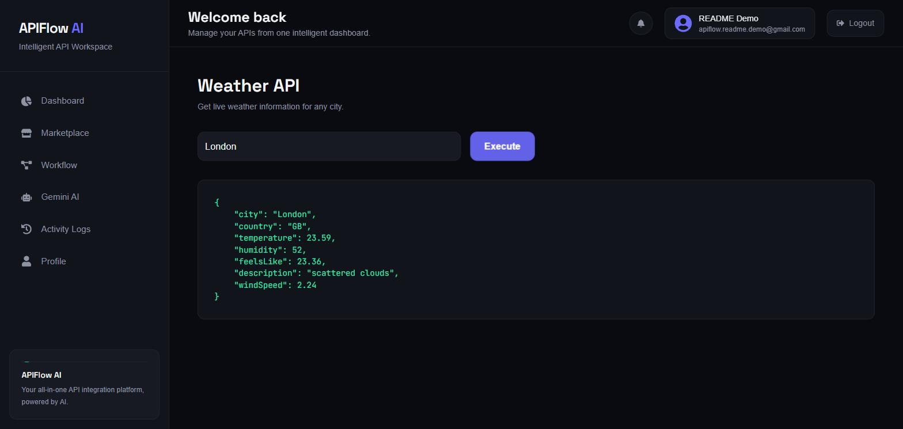 | **GitHub Lookup** 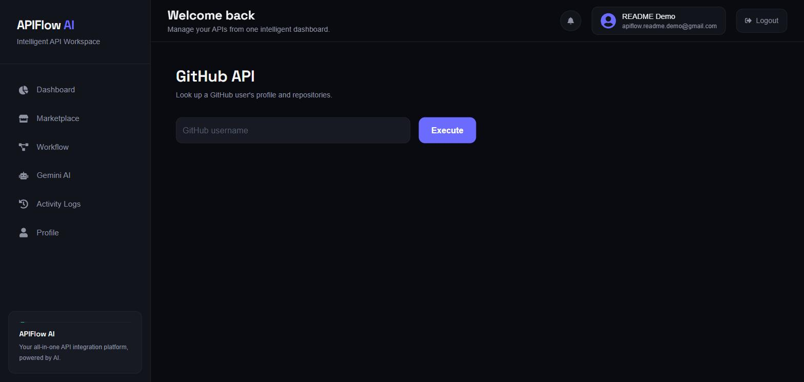          |
| **News Executor** 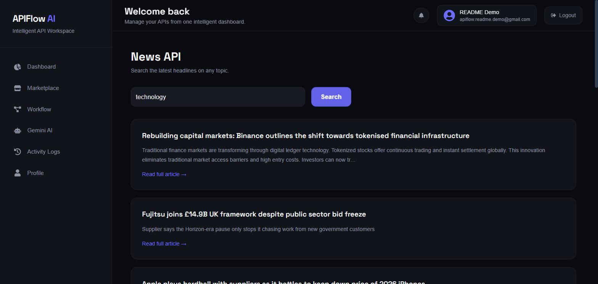          | **Currency Converter** 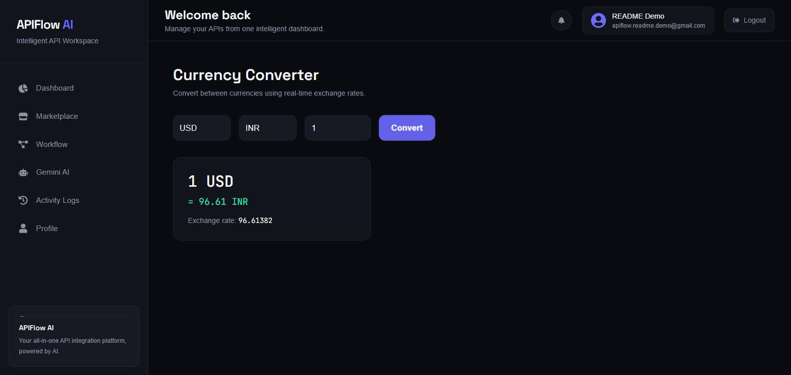 |
| **Gemini AI Chat** 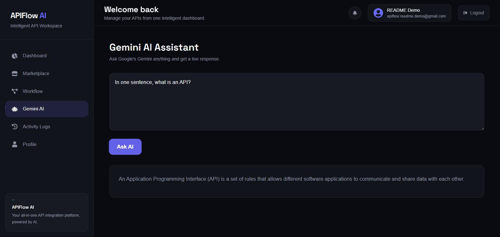     | **Workflow Builder** 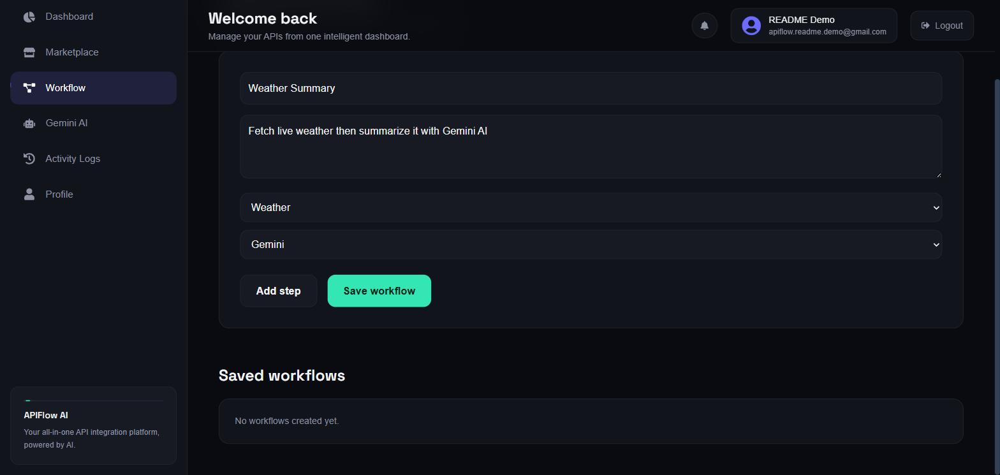    |
| **Execution Logs** 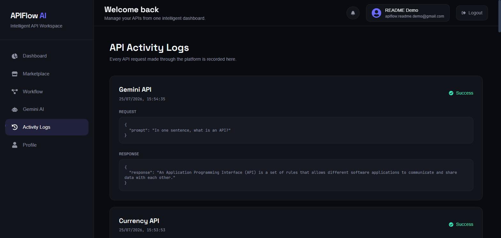                  | **Profile** 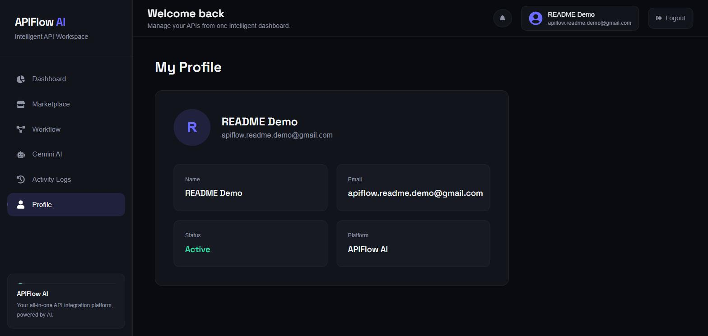                       |

<sub>Tip: on Windows/Mac use Snipping Tool / ⌘+Shift+4 against the live demo link above at 1440×900 for consistent, clean captures.</sub>

---

## ✨ Features

- 🔐 **JWT Authentication** — register/login with hashed passwords (bcryptjs) and protected routes via middleware
- 🌤 **Weather Lookup** — live conditions by city (OpenWeather API)
- 📰 **News Search** — keyword-based article feed (NewsAPI)
- 💰 **Currency Conversion** — real-time exchange rates
- 🐙 **GitHub User Lookup** — public profile stats via the GitHub REST API
- 🤖 **Gemini AI Chat** — Google Gemini–powered conversational assistant, also used to auto-analyze API output inside workflows
- ⚙️ **Visual Workflow Builder** — chain multiple APIs into a single sequential pipeline (e.g. Weather → Gemini summarization) and run it in one click
- 📜 **Execution Logs** — every API/workflow call is persisted per-user with status (success/failed) and payload
- 📊 **Dashboard Analytics** — usage stats and recent activity at a glance
- ☁️ **Fully Cloud Deployed** — frontend on Vercel, backend on Render, data on MongoDB Atlas

---

## 🖥 Tech Stack

**Frontend**

- React 19 + Vite
- React Router DOM v7
- TanStack Query, React Hook Form + Zod
- Tailwind CSS v4, Framer Motion, Recharts
- Axios, react-hot-toast / sonner, lucide-react / react-icons

**Backend**

- Node.js + Express 5
- MongoDB Atlas + Mongoose
- JWT (jsonwebtoken) + bcryptjs
- Google Gemini SDK (`@google/genai`) and OpenAI SDK
- Axios for outbound third-party API calls

**External APIs**

- OpenWeather API
- NewsAPI
- Exchange Rate API
- GitHub REST API
- Google Gemini API

**Deployment**

- Frontend → Vercel
- Backend → Render
- Database → MongoDB Atlas

---

## 📂 Project Structure

```
multi-api-integration-platform/
│
├── frontend/
│   ├── src/
│   │   ├── components/
│   │   │   ├── auth/            # AuthInput, AuthLayout
│   │   │   ├── dashboard/       # StatCard, AnalyticsCard, ActivityTimeline, QuickActions...
│   │   │   ├── landing/         # Hero, Features, HowItWorks, WorkflowShowcase, Navbar, Footer
│   │   │   └── ui/              # Button, Card, Badge, FlowLine, SectionHeading
│   │   ├── context/             # AuthContext
│   │   ├── layouts/             # MainLayout
│   │   ├── pages/
│   │   │   ├── Home.jsx, Login.jsx, Register.jsx
│   │   │   ├── Dashboard.jsx, APIMarketplace.jsx
│   │   │   ├── WorkflowBuilder.jsx, Logs.jsx, Profile.jsx
│   │   │   └── executor/        # WeatherExecutor, GithubExecutor, NewsExecutor, CurrencyExecutor, GeminiExecutor
│   │   └── App.jsx               # Route definitions
│   └── package.json
│
├── backend/
│   ├── controllers/              # auth, weather, news, currency, github, gemini, workflow(+execution), log, dashboard, user
│   ├── middleware/                # authMiddleware (JWT protect)
│   ├── models/                    # User, Workflow, ApiLog
│   ├── routes/                    # one router per feature, mounted under /api/*
│   ├── utils/                     # generateToken, createApiLog
│   ├── config/db.js               # Mongoose connection
│   ├── app.js                     # Express app + route mounting
│   └── server.js                  # Entry point
│
├── .postman/ , postman/            # Postman collection assets for API testing
└── README.md
```

---

## 🚀 Getting Started

### Clone Repository

```bash
git clone https://github.com/Satwik367/multi-api-integration-platform.git
cd multi-api-integration-platform
```

### Backend Setup

```bash
cd backend
npm install
```

Create a `.env` file in `backend/`:

```env
PORT=5000
MONGO_URI=YOUR_MONGODB_URI
JWT_SECRET=YOUR_SECRET
WEATHER_API_KEY=YOUR_KEY
NEWS_API_KEY=YOUR_KEY
GEMINI_API_KEY=YOUR_KEY
```

Run:

```bash
npm run dev
```

### Frontend Setup

```bash
cd frontend
npm install
```

Create a `.env` file in `frontend/`:

```env
VITE_API_URL=http://localhost:5000/api
```

Run:

```bash
npm run dev
```

---

## 🔑 API Endpoints

All routes below (except register/login) require a `Bearer` JWT from `/api/auth/login`, sent via `Authorization: Bearer <token>`.

### Authentication

```
POST /api/auth/register     Create a new account
POST /api/auth/login        Log in, returns JWT
GET  /api/auth/me           Get current authenticated user
```

### Core API Integrations

```
GET  /api/weather           Get current weather for a city
GET  /api/news              Search news articles by query
GET  /api/currency          Convert between currencies
GET  /api/github            Look up a GitHub user's public profile
POST /api/gemini            Chat with Google Gemini
```

### Workflows

```
GET    /api/workflows       List all workflows for the logged-in user
POST   /api/workflows       Create a new workflow (name + ordered steps)
POST   /api/workflows/:id/run   Execute a workflow's steps sequentially
DELETE /api/workflows/:id   Delete a workflow
```

### Logs, Dashboard & Profile

```
GET  /api/logs              Get this user's execution history (API + workflow calls)
GET  /api/dashboard          Get aggregated stats for the dashboard
GET  /api/users/profile      Get the logged-in user's profile
```

---

## ⚙️ How Workflows Work

A **Workflow** is a named, ordered list of API "steps" (`Weather`, `GitHub`, `News`, `Gemini`) stored per user. When executed via `POST /api/workflows/:id/run`, the backend runs each step in sequence, feeding the previous step's output forward — for example, pulling live weather data and then passing it to Gemini to generate a natural-language summary. Every run (success or failure) is written to the `ApiLog` collection for later inspection in the Logs page.

---

## 🎯 Future Improvements

- 🐳 Docker support
- ☸️ Kubernetes deployment
- 🔑 Role-Based Access Control (RBAC)
- 🔐 OAuth login (Google/GitHub)
- ⏰ Workflow scheduler (cron-based runs)
- 📧 Email notifications
- 🔗 Webhooks
- 🛒 API marketplace with third-party plugins
- 🧠 AI-suggested workflows based on usage patterns

---

## 👨‍💻 Author

**Satwik Maiti**
GitHub: [@Satwik367](https://github.com/Satwik367)

---

## ⭐ Support

If you found this project useful, consider giving it a ⭐ on GitHub.

```
Made with ❤️ using React, Node.js, Express and MongoDB.
```
